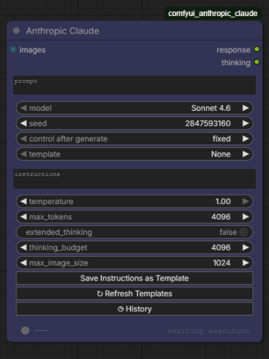

# Anthropic Claude for ComfyUI

A ComfyUI node that calls the Anthropic Claude API directly from your workflow. Send text prompts, attach images for vision analysis, use instruction templates, and get responses with cost tracking, all without leaving ComfyUI.

## What It Does

- **Text and vision**: send text prompts with optional images to any Claude model
- **21 built-in templates**: pre-written instructions for popular AI video/image models (generation and editing)
- **Save your own templates**: create and reuse custom instruction sets
- **Execution history**: searchable log of every run with cost tracking, favorites, and one-click settings restore
- **Model selection**: auto-fetched from the Anthropic API
- **Extended thinking**: Claude's chain-of-thought reasoning with configurable budget
- **Cost tracking**: token usage and USD cost after every run
- **Live API status**: colored dot in the footer shows Claude API health in real time
- **Seed-based caching**: fixed seed reuses the cached response, randomize forces a new one

## Install

Open **ComfyUI Manager**, search for "Anthropic Claude", and install.

Manual install and full setup: [Getting Started](getting-started.md)

## Links

- [Getting Started](getting-started.md): install, API key setup, first run
- [Usage Guide](usage.md): all inputs, templates, history, vision, extended thinking, caching
- [Troubleshooting](troubleshooting.md): common errors and fixes
